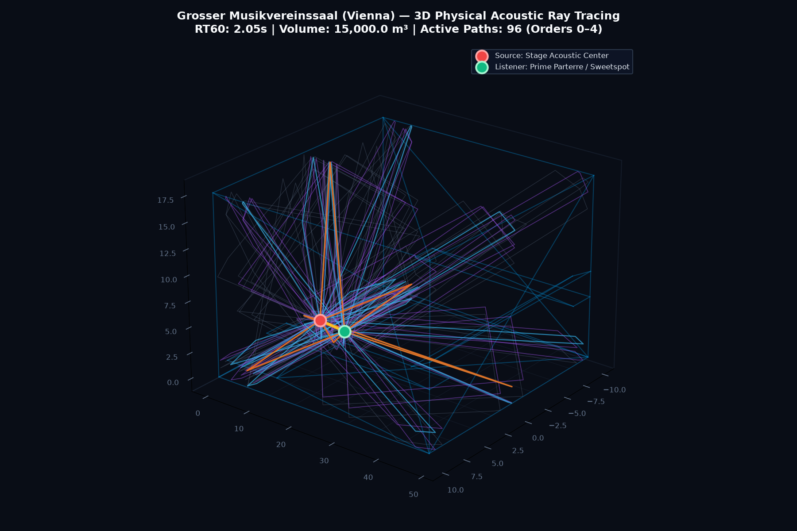

# AetherBeam Reverb v1.0



A high-fidelity digital acoustic reverberation plugin combining **3D Geometric Acoustic Ray-Tracing (Orders 0–4)** with **Finite-Amplitude Nonlinear Waveguide Physics** and a **3-Band Material Damping EQ**.

Built with modern **JUCE 8** and C++17 by **Kijjaz & Gemini 3.8 Flash**.

---

## 🚀 Downloads & Pre-Built Binaries

Pre-compiled Release binaries for all platforms are built automatically via GitHub Actions CI:

* **[Download Latest Automated Builds (macOS, Windows, Linux)](https://github.com/kijjaz/audio-plugins/actions/workflows/aetherbeam.yml)**  
  *(Click on the latest passing workflow run, scroll down to the **Artifacts** section, and download your operating system's bundle)*

### Available Formats:
* 🍏 **macOS (Universal 2: Apple Silicon `arm64` + Intel `x86_64`)**:
  * **VST3**: `AetherBeam Reverb.vst3` (copy to `~/Library/Audio/Plug-Ins/VST3/`)
  * **AU (Audio Unit)**: `AetherBeam Reverb.component` (copy to `~/Library/Audio/Plug-Ins/Components/`)
  * **Standalone App**: `AetherBeam Reverb.app`
  * *Note*: If macOS displays an unidentified developer prompt, run:
    ```bash
    xattr -cr ~/Library/Audio/Plug-Ins/VST3/"AetherBeam Reverb.vst3"
    xattr -cr ~/Library/Audio/Plug-Ins/Components/"AetherBeam Reverb.component"
    ```
    or click **"Open Anyway"** in **System Settings  → Privacy & Security**.
* 🪟 **Windows (64-bit x64)**:
  * **VST3**: `AetherBeam Reverb.vst3` (copy to `C:\Program Files\Common Files\VST3\`)
  * **Standalone Executable**: `AetherBeam Reverb.exe`
* 🐧 **Linux (64-bit x86_64)**:
  * **VST3**: `AetherBeam Reverb.vst3` (copy to `~/.vst3/`)

---

## ✨ Key Architectural Features

### 1. Real-Time 3D Ray-Tracing Engine (Orders 0 to 4)
* **Physically Contained Specular Paths**: Computes up to 96 physical acoustic reflection paths in real time.
* **Strict Architectural Boundary Containment**: Validates reflection vertices against genuine non-box architecture (pitched ceilings, domes, semicircular exedrae), discarding any rays that escape into open space.
* **Interactive 3D Visualizer**: Real-time rotating wireframe renderer showing sound source (🔴), listener (🟢), direct line-of-sight beam (🟡), and color-coded higher-order reflections. You can drag source and listener directly on the 3D plane while audio runs lock-free.

### 2. Spatial Microphone Polar Patterns & Directionality
Select authentic microphone pickup patterns and configure stereo staging:
* **Binaural (HRTF Spherical Shadowing)**: Woodworth-Schlosser time-of-flight ITD and high-frequency head-shadowing filter.
* **ORTF Cardioid Pair**: French standard 110 deg angle with 17 cm physical capsule spacing.
* **Blumlein Figure-8 Pair**: 90 deg bidirectional coincident ribbon arrangement providing classic holographic imaging.
* **Omni Stereo Pair**: 40 cm spaced pressure transducers capturing spacious, uncolored room ambience.
* **Continuous Stereo Width**: 0.0x (mono sum), 1.0x (natural acoustic stage), up to 2.0x (hyper-wide side energy).

### 3. Audience & Furnishing Absorption Simulator (Occupancy Dial)
* Computes real-time dynamic room absorption adjustments based on Sabine and Eyring acoustic physics.
* Dynamically scales RT60 decay times (reducing total reverberation by up to 27.5% at full occupancy) and steepens high-frequency absorption roll-off as the hall fills with audience and plush upholstery.

### 4. Finite-Amplitude Acoustic Shock Wave Steepening ($fff$ Dynamics)
* Simulates physical air wave steepening governed by **Burgers' equation** under high acoustic sound pressure levels up to **$122\text{ dB SPL}$** (simulating a full symphony orchestra playing at *fortississimo*).
* Uses the **Fubini-Bessel series** to model subtle quadratic and cubic overtone generation in early reflections, giving brass and orchestral percussion authentic physical impact in the room.

### 5. 3-Band Material Absorption & Damping EQ
Sound recirculating dozens of times through an acoustic space experiences exponential spectral shaping:
* **HF Damping (`dampFreq`)**: Sweepable from $800\text{ Hz}$ to $18,000\text{ Hz}$ to model absorption by carpets, clothing, audience, and curtains.
* **HF Decay Multiplier (`hfDecayMult`)**: Controls the relative decay rate of treble against mid frequencies ($0.1\times - 1.0\times$).
* **Bass Decay Multiplier (`bassDecayMult`)**: Low-frequency modifier below $250\text{ Hz}$ ($0.2\times - 2.5\times$) modeling wooden stage resonance vs. rigid granite.

---

## 🎛️ Control Deck Reference

| Group | Control | Range | Description |
| :--- | :--- | :--- | :--- |
| **Air Dynamics** | **Air Beta** | $0.00 - 2.50$ | Acoustic nonlinearity parameter ($\beta = 1 + B/2A$). Sets wave steepening intensity. |
| | **Drive SPL** | $80 - 150\text{ dB}$ | Virtual source sound pressure level. At $122\text{ dB}$ ($fff$), air harmonics activate. |
| **Material & Occupancy** | **RT60 Scale** | $0.20\times - 2.50\times$ | Dynamic time scale for reverberation decay. Updates smoothly in real time. |
| | **Occupancy** | $0\% - 100\%$ | Audience & furnishing absorption. Dynamically scales $RT_{60}$ and HF damping. |
| | **HF Damping** | $800 - 18,000\text{ Hz}$ | High-frequency absorption corner frequency (carpet, curtains, audience). |
| | **HF Mult** | $0.10\times - 1.00\times$ | Relative decay speed of high frequencies. |
| | **Bass Mult** | $0.20\times - 2.00\times$ | Low-frequency resonance modifier below $250\text{ Hz}$. |
| **Spatial Mic & Output** | **Mic Pattern** | Binaural / ORTF / Blumlein / Omni | Capsule polar pattern and spatial geometry. |
| | **Stereo Width** | $0.00\times - 2.00\times$ | Mid/Side stereo width processing. |
| **Output** | **Dry / Wet** | $0.0\% - 100.0\%$ | Equal-power linear interpolation dry/wet mix. |

---

## 🏛️ Modeled Spaces Included

1. **Musikverein Golden Hall (Vienna)** ($48.8\text{m} \times 19.1\text{m} \times 17.7\text{m}$, $RT_{60} = 2.05\text{s}$)
2. **Sydney Opera House Concert Hall** ($52.0\text{m} \times 26.0\text{m} \times 25.0\text{m}$, $RT_{60} = 2.00\text{s}$, vaulted pitched roof)
3. **Hagia Sophia Byzantine Cathedral (Istanbul)** ($65.0\text{m} \times 60.0\text{m} \times 55.0\text{m}$, $RT_{60} = 11.00\text{s}$, stepped dome)
4. **St. James UNESCO Cathedral (Šibenik)** ($40.5\text{m} \times 17.0\text{m} \times 29.8\text{m}$, $RT_{60} = 4.80\text{s}$, barrel vaults)
5. **Sponza Palace Atrium (Dubrovnik)** ($18.0\text{m} \times 12.0\text{m} \times 14.5\text{m}$, $RT_{60} = 2.45\text{s}$, stone loggia)
6. **Capitol Studios Echo Chamber 4 (Los Angeles)** ($6.8\text{m} \times 4.2\text{m} \times 3.4\text{m}$, $RT_{60} = 4.20\text{s}$, lacquered trapezoid)
7. **Abbey Road Studio 2 Chamber (London)** ($RT_{60} = 3.10\text{s}$, tiled diffusers)
8. **Rome Pantheon (Rome)** ($R = 21.65\text{m}$, $H = 43.3\text{m}$, $RT_{60} = 7.50\text{s}$, oculus hemisphere)
9. **Hamilton Mausoleum (Scotland)** ($RT_{60} = 15.00\text{s}$, record high-decay circular dome)
10. **Epidaurus Ancient Amphitheatre (Greece)** (Open-air direct & ground acoustic field)

---

## 📚 Physical & Mathematical Documentation

A comprehensive mathematical paper detailing the exact Burgers' wave equation, Fubini-Bessel series derivation, and 3D ray-folding geometry is included:
* 📄 [Mathematical Paper (PDF)](Showcase_IRs/AetherBeam_Mathematical_Acoustic_Engine.pdf)
* 📝 [LaTeX Source](Showcase_IRs/AetherBeam_Mathematical_Acoustic_Engine.tex)

---

## 🛠️ Building from Source

### Prerequisites:
* CMake 3.22 or newer
* C++17 compliant compiler (Clang on macOS, MSVC on Windows, GCC 10+ on Linux)
* Ninja or Make

### macOS / Linux:
```bash
cmake -S . -B build -DCMAKE_BUILD_TYPE=Release
cmake --build build --config Release -j 4
```

### Windows (Visual Studio x64 Command Prompt):
```cmd
cmake -S . -B build -DCMAKE_BUILD_TYPE=Release
cmake --build build --config Release --parallel 4
```
*(If JUCE is not installed locally, CMake automatically downloads official JUCE 8 from GitHub via `FetchContent`)*.
